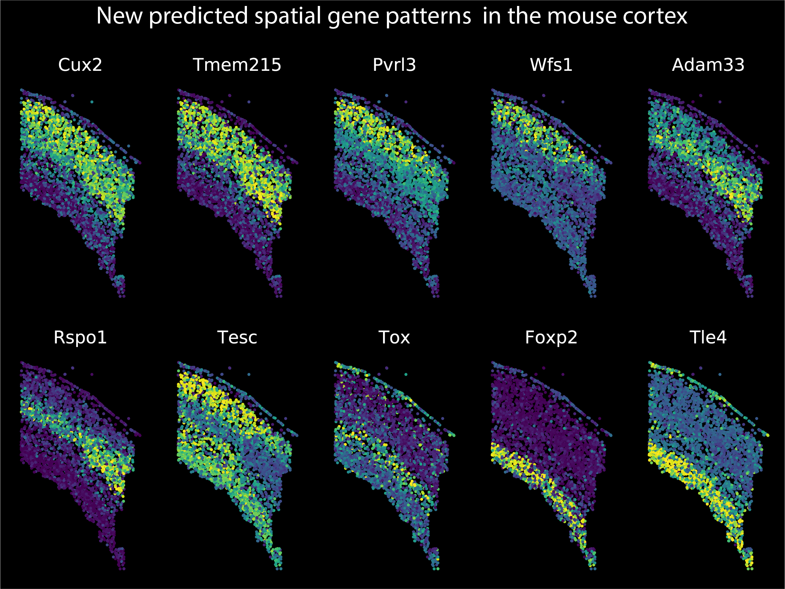

# SpaGE
## Predicting whole-transcriptome expression of spatial transcriptomics data through integration with scRNA-seq data 

### Implementation description

Python implementation can be found in the 'SpaGE' folder. The ```SpaGE``` function takes as input i) two single cell datasets, spatial transcriptomics and scRNA-seq, ii) the number of principal vectors *(PVs)*, and iii) the set of unmeasured genes in the spatial data for which predictions are obtained from the scRNA-seq (optional). The function returns back the predicted expression for these unmeasured genes across all spatial cells. 

For full description, please check the ```SpaGE``` function description in ```main.py```.

### Tutorial

The ```SpaGE_Tutorial``` notebook is a step-by-step example showing how to validate SpaGE on the spatially measured genes, and how to use SpaGE to predict new spatial gene patterns.

<p align="center">
  
</p>

### Experiments code description

The 'benchmark' folder contains the scripts to reproduce the results shown in the pre-print. The bencmark folder has five subfolders, each corresponds to one dataset-pair and contains the scripts to run SpaGE, Seurat-v3, Liger and gimVI. Additionally, we provide evaluation scripts to calculate and compare the performance of all four methods, and to reproduce all the figures in the pre-print.

### Datasets

All datasets used are publicly available data, for convenience datasets can be downloaded from Zenodo (https://doi.org/10.5281/zenodo.3967291)

For citation and further information please refer to:
"SpaGE: Spatial Gene Enhancement using scRNA-seq", [biorxiv](https://www.biorxiv.org/content/10.1101/2020.05.08.084392v1)
